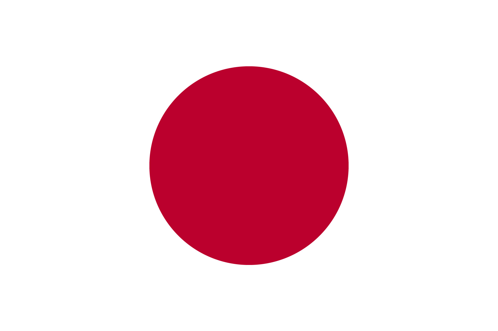

# Japanese Flag made by shader and three.js

I created Japanese flag which is realistically waving.
And I was really amazed by a few lines of code works really well in Three.js.
You can tweek my flag on your browser.

## Reference

#### Three.js journey
